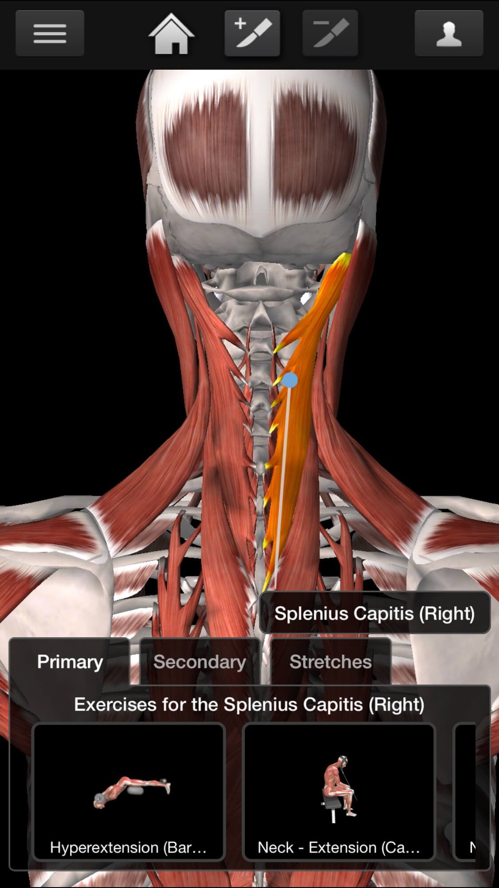
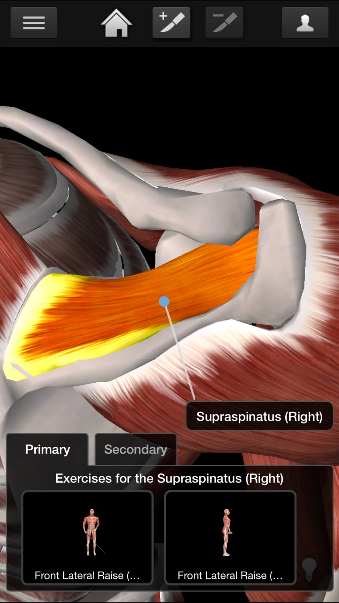

# careyourbody
保护好身体

- 叩齿咽津翕周法
每日清晨起床后叩齿100次，然后用舌舔上腭及舌下齿龈，含津液满口后再频频咽下，意送至丹田，此谓“叩齿咽津”。翕周即收缩肛门，吸气时将肛门收紧，呼气时放松，如此一收一松为一次，每次连续做50次，可滋阴降火，固齿益精，能防治性功能衰退。

- 金刚铁板桥
- 平板支撑（小平板支撑）
- 蹲墙

热身
- 俯身飞鸟
- 最强体式
- 俯身转体

跳绳

## 身体部位

- 三个部位合起来运动时间是30min.
- 每天两个30min的package 

## 推荐应用

iMuscle2
咕咚-训练-背部轰炸

